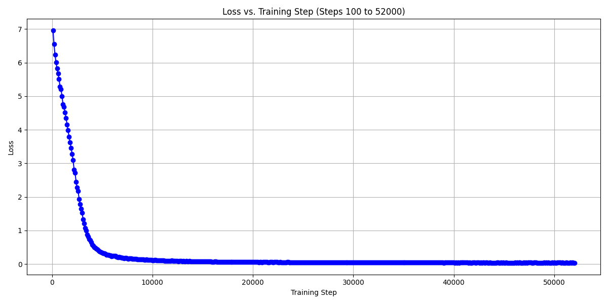

# Dream of the Red Chamber (红楼梦) LLM Pretraining

This project is dedicated to pretraining a large language model (LLM) on the classic Chinese novel *Dream of the Red Chamber* (红楼梦). This classic 18th-century novel, written by Cao Xueqin, is my favoriate Chinese classical literature and offers a rich tapestry of character studies, intricate relationships, and profound insights into Qing Dynasty society, making it an ideal corpus for training a language model with a deep understanding of classical Chinese literature and cultural nuance. By leveraging this timeless masterpiece, the goal is to capture its rich narrative style, intricate language, and cultural nuances in a transformer-based model. 

## Overview for 1st pretraining

- **Dataset**: Chapters 1-80 from *Dream of the Red Chamber* (红楼梦) [download link](https://archive.org/details/20210205_20210205_1123/page/16/mode/2up?utm_source=chatgpt.com)
- **Model Architecture**: A GPT-style transformer configured with:
  - **vocab_size**: 5000 tokens
  - **block_size**: 256 (context window size)
  - **n_layer**: 12 transformer layers
  - **n_head**: 12 attention heads per layer
  - **n_embd**: 768-dimensional embeddings
  - **dropout**: 0.1
- **Total Parameters**: Approximately 88–89 million (depending on implementation details)

## Features

- **Pretraining Objective**: The model is trained in a self-supervised manner to predict the next token, learning the unique style and language of the text.
- **Tokenizer**: Uses a custom tokenizer (with `vocab.json` and `merges.txt`) tailored for classical Chinese.
- **Inference**: Once pretrained, the model can generate text in the style of *Dream of the Red Chamber*, providing insights into classical literature with modern language modeling techniques.

## Compute
1 RTX6000 with 25GB HBM was used to run `pretrain.py`. The entire script took 13 hours and 42 minutes to finish after runnig for 2000 epochs with batch size 64 and learning rate 3e-5.

## Sample Generated Text

Below is an example of text generated by our pre-trained LLM using the "Dream in Red Chamber" dataset:

<pre>
花袭人有始有终数人，去年岁分离，采置一，采置些墨笛私。”贾珍冷笑道：“你把那界镯子尚面，都是办见识，这么个轻狂！连老爷还不够使？连这个 还不够使？短一分去，竟不大先收在瓢呢，这不是个人一点子，平姑娘又这样嘴霸道的，一家子都管了！如今今年，原来要为这个不尊重，往家去取戏 的愿。凡有了不是，我只和你们作了媳妇，奚落了几天，也是鬼鬼祟祟的。我找了你去，到什么东西，我听你。”说著，便起身告辞。李纨道：“咱们别 哄著，等我问著他。”一面说著，一面连日起身出来。 
　　雨村遂起身往东边院外，穿过院中的小丫头，请凤姐入画，过后院子里人所有的东西家务事，且不长进。凤姐身体又没了钱粮。”凤姐听了，心中忖半晌答道：“虽如此说，张爷爷们每日令奶奶的过了两。连那边的主子名堂客就完了，再慢慢的写。”探春冷笑道：“这个还算命呢，我这里要匀情，知道拣了没黄柏，那里都唱《南华经》。近云丫头在家里，就知道了。”说著便往外走。宝玉见他这样，还想著，还这山坡之孤种，就不入了，起来，其不肯情，若好少不得你，倒不好。”宝玉道：“这怕什么。等他们孝满了，他爱什么难道不许你送他别的不成。你若这样，还是你素日为人了！况且不是瞒人 的事，只管告诉宝姐姐也可，只不过怕姨妈老人家生气罢了。”香菱想了一想有理，便点头笑道：“就是这样罢了，别辜负了你的心。我等著你，千万叫 他亲自送来才好。”宝玉听了，喜欢非常，答应了忙忙的回来
</pre>