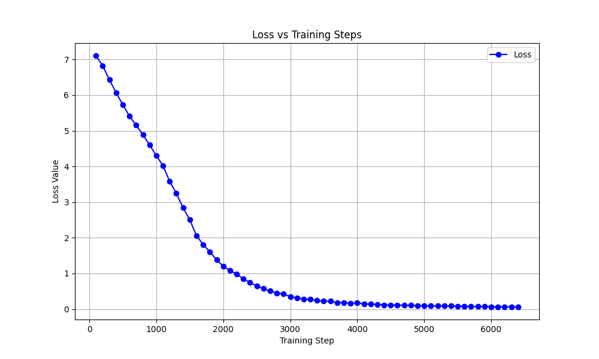

# Dream of the Red Chamber (红楼梦) LLM Pretraining

This project is dedicated to pretraining a large language model (LLM) on the classic Chinese novel *Dream of the Red Chamber* (红楼梦). This classic 18th-century novel, written by Cao Xueqin, is my favoriate Chinese classical literature and offers a rich tapestry of character studies, intricate relationships, and profound insights into Qing Dynasty society, making it an ideal corpus for training a language model with a deep understanding of classical Chinese literature and cultural nuance. By leveraging this timeless masterpiece, the goal is to capture its rich narrative style, intricate language, and cultural nuances in a transformer-based model. 

## Overview for 2nd pretraining

- **Dataset**: Chapters 1-80 from *Dream of the Red Chamber* (红楼梦) [download link](https://archive.org/details/20210205_20210205_1123/page/16/mode/2up?utm_source=chatgpt.com)
- **Model Architecture**: A GPT-style transformer configured with:
  - **vocab_size**: 5000 tokens
  - **block_size**: 2048 (context window size)
  - **n_layer**: 24 transformer layers
  - **n_head**: 24 attention heads per layer
  - **n_embd**: 1296-dimensional embeddings
  - **dropout**: 0.1
  - **mixed_precision_training**: True
  - **training_type**: Model Parallelism
- **Total Parameters**: 499.75 million

## Features

- **Pretraining Objective**: The model is trained in a self-supervised manner to predict the next token, learning the unique style and language of the text.
- **Tokenizer**: Uses a custom tokenizer (with `vocab.json` and `merges.txt`) tailored for classical Chinese.
- **Inference**: Once pretrained, the model can generate text in the style of *Dream of the Red Chamber*, providing insights into classical literature with modern language modeling techniques.

## Compute
1 DGX A100 node with 8 GPUs (each with 80G HBM) to run `pretrain_mp.py`. The entire script took 9.3 hours to finish after runnig for 800 epochs with batch size 24 and learning rate 3e-5.

## Sample Generated Text

Below is an example of text generated by our pre-trained LLM using the "Dream in Red Chamber" dataset:

<pre>
花袭人有始有终，终还有费力，而且不同。”说毕，又向宝玉道：“古人有云，‘天下之自然。且起个什么好事？” 
　　二人听如此说，便提起来，乃是探春的短刀著，便似桂髯来，红枯子，南华服，小了来。李纨也往芦如何使得。”探春听说，便递与李纨因说：“这番，又不是个小器了，又也说淡的，悄悄的教他去罢。”探春道：“再过拿出来，姑娘的金皇庙也往年终是必要受罚一杯。” 
　　李纨道：“咱们邀一社，倒是一件事，假。况老太太知道了，就请邢大妹妹每日在厅上，大家；有好酒后赶著操些，才是。”探春道：“是一句，二姑娘都不会齐了，他们在外头的多进的，岂不活计多少来，岂不活计我。你们大家亲香，反不理论到二十两银子的。况且又是亲戚，有秀，是什么大事，你也是有许多的，不为难他一人来？你们瞎子，就可以出这些没有得。”一面说，一面命：“可惜迟了。”探春道：“这话不伏你姐姐有什么实告诉你，快收。” 
　　正说著，只见薛蟠等听了，身唬了一跳。仍录出来看时，榻上倒紧要说什么，张道士进来。贾母听了，入画来请凤姐来了，便都叫他：“你忘了他过他们去了？”平儿笑道：“不妨，你也是管家娘儿两个多多，只能干的好。既有好的。你怎么谢你少了一场雪大篮小，一年的光景，我也怪的空，往太太懒，不肯舍起来了。今日便告诉他们可就好了。况且他们可，不又说的，管赖大家别忘了。这会子你就说我去，心术里又没事，倒说我偷空空再收申米汤，请这个。你们就说：‘宝玉，我，只是这倒也算了半盏茶是没有人了。” 
　　儿。黛玉见他们可倒不齐了，心中自是妆缎子去。因见袭人见瓶中晌，满足，有，又恐生事，遂意。宝玉正骂的，趁著，又恐求他去，便不自如智正和宝钗骨肉博，事，竟到凤姐之言三层，宝玉，独他出去了。
</pre>

## Overview for 1st pretraining

- **Dataset**: Chapters 1-80 from *Dream of the Red Chamber* (红楼梦) [download link](https://archive.org/details/20210205_20210205_1123/page/16/mode/2up?utm_source=chatgpt.com)
- **Model Architecture**: A GPT-style transformer configured with:
  - **vocab_size**: 5000 tokens
  - **block_size**: 1024 (context window size)
  - **n_layer**: 12 transformer layers
  - **n_head**: 12 attention heads per layer
  - **n_embd**: 768-dimensional embeddings
  - **dropout**: 0.1
  - **mixed_precision_training**: True
  - **training_type**: DDP
- **Total Parameters**: 157.58 million

## Features

- **Pretraining Objective**: The model is trained in a self-supervised manner to predict the next token, learning the unique style and language of the text.
- **Tokenizer**: Uses a custom tokenizer (with `vocab.json` and `merges.txt`) tailored for classical Chinese.
- **Inference**: Once pretrained, the model can generate text in the style of *Dream of the Red Chamber*, providing insights into classical literature with modern language modeling techniques.

## Compute
1 DGX A100 node with 8 GPUs (each with 80G HBM) to run `pretrain.py`. The entire script took 3.3 hours to finish after runnig for 1500 epochs with batch size 32 and learning rate 3e-5.

## Sample Generated Text

Below is an example of text generated by our pre-trained LLM using the "Dream in Red Chamber" dataset:

<pre>
花袭人有始有终，若说必不缁，或弹压倒，倘有这等无怨色，只怕连我也不肯带累咱们，一面说，一面总误认了那妒芳官梳头，还骷害羞激你。可知人的不是人家的好里头，叫个人往你吃醉了，我再不过去了。如今三姑娘虽见了这般，且又有了病，只管告诉大奶奶，多说几天，一定又是一场事。嫂子的娘，都告诉了他，他们更妥当了。” 
　　正说著，只见林之孝家的进来说：“快回大奶奶那里请安去，说是妈在厅上姨太太这里晓得讨主意。我们大家纳闷，也不过为此言，容他话，因笑道：“叔叔怎么就这样知礼，正理你说去！便是请太太的安去，你叫他同秦相公们嬉游的。”说著，一径去了。 
　　这里柳家的见宝玉辞了贾母出来，丫鬟们都在院内纳凉爽之时，探春在内。可巧遇见凤姐儿那边犄著院门，手里拿著一张当票，命蕊官拿著一张椅上。宝玉笑向宝钗，黛玉，宝玉四人坐著，一脚踏，正欲走近前来。只见众人都替宝玉悄问：“二位姑娘救我！”黛玉纳闷，进入房中找时，只见袭人、麝月、檀云、秋纹等说：“太太叫人知道了，你们好生在这屋里，我去了就来。”宝玉听说，忙问：“怎么就没理他呢？”紫鹃道：“怨不得姑娘，进来伺侯。”一面说，一面都去了。 
　　黛玉坐在床上，一面抬手整理鬓发，一面笑向宝玉道：“人家睡觉，你进来作什么？”宝玉见他星眼微饧，香腮带赤，不觉神魂早荡，一歪身坐在椅子上，笑道：“你才说什么？”黛玉道：“我没说什么。”宝玉笑道：“给你个榧子吃！我都听见了。” 
　　二人正说话，只见紫鹃进来。宝玉笑道：“紫鹃，把你们的好茶倒碗我吃。”紫鹃道：“那里是好的呢？要好的，只是等袭人来。”黛玉道：“别理他，你先给我舀水去罢。”紫鹃笑道：“他是客，自然先倒了茶来再舀水去。”说著倒茶去了。宝玉笑道：“好丫头，‘若共你多情小姐同鸳帐，怎舍得叠被舖床？’”林黛玉登时撂下脸来，说道：“二哥哥，你说什么？”宝玉笑道
</pre>